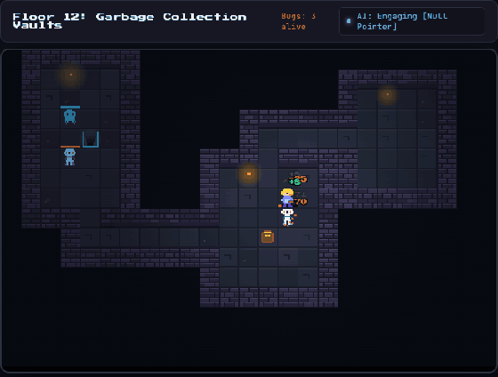

# ⚔️ Pixel Dungeon: Auto-Play Bug Slayer

A retro dungeon crawler that plays itself. A pixel hero works down through procedurally generated floors, fixing bugs (the monsters), opening chests and gearing up. You can leave it running while a build or an AI task finishes, or press Tab and play it yourself.


-success)

**[▶ Play it in your browser](https://bryanfrds.github.io/dragons-dungeon-game/)**



---

## 🎮 Features

- **It plays itself.** The AI goes for the closest bug, finds a route to it with breadth-first search, fights it, drinks a potion below 35% HP, spins a Whirlwind when two or more bugs are next to it, and loots chests before taking the stairs.
- **Take over any time.** Tab switches between the AI and the keyboard.
- **Bugs to fix**, each with its own habits. They chase you once you're within 5 tiles, and get tougher the deeper you go:
  - **Syntax Error** (slime): slow. From floor 1.
  - **Memory Leak** (ghost): quick. From floor 3.
  - **Race Condition** (two sparks): fragile, fast, and strikes twice as often. From floor 4.
  - **Null Pointer** (skeleton): hits hard. From floor 5.
  - **Infinite Loop** (a ring chasing its tail): heals itself unless you finish it quickly. From floor 7.
  - **Merge Conflict**: the boss, every fifth floor.
- **A shop between floors.** Spend gold on potions or permanent upgrades: +3 attack, +2 defence or +20 max HP. Each upgrade costs more than the last. On autoplay the AI shops too, stocking up to 3 potions and then buying the cheapest upgrade it can afford.
- **Best floor**: the deepest floor you've reached is kept in the header, even after you die.
- **Loot** in four rarities: common, rare, epic and legendary. Better swords and armor are equipped automatically, and every new relic (ring, fang, boots or stone) is put on.
- **Levels:** every level-up raises HP, MP, attack and defence and gives a potion (you can carry up to 5).
- **Saves itself** in your browser every few seconds: floor, best floor, gold, level, gear and shop upgrades.
- **8-bit sound** synthesised with the Web Audio API, so there are no audio files. Mute it with 🔊 or M, and it stays muted next time.
- **Speed control** at 1×, 2× or 4×.

---

## 🚀 How to Run

Play the live version at **https://bryanfrds.github.io/dragons-dungeon-game/**.

To run it yourself, there's no build step and no dependencies. Open `index.html` in a browser, or serve the folder:

```bash
python3 -m http.server 8000
# then visit http://localhost:8000
```

Add `?portrait` to the URL to turn the map on its side, which suits a tall, narrow pane.

---

## ⌨️ Controls

| Key | Action |
| --- | --- |
| **Tab** | Switch between the AI and manual play |
| **WASD / Arrows** | Move (walk onto a chest to open it) |
| **Space** | Attack (manual play) |
| **1** | Whirlwind: hits every bug next to you |
| **2** | Iron Wall: 2.5× defence for 4 seconds |
| **3** | Health potion: restores half your HP |
| **M** | Sound on/off (remembered next time) |

---

## 📁 Project Structure

```
index.html   page layout
style.css    styling
game.js      game loop, combat, loot, saving, and the auto-play AI
dungeon.js   floor generation and path-finding
sprites.js   pixel-art sprites, drawn in code
audio.js     sound effects, synthesised with the Web Audio API
rules.js     levelling, gear, damage and speed rules, kept apart so they can be tested
tiles.js     draws each floor's brick walls and stone once
tests/       Node tests: floor generation, the rules, and game behaviour
```

Run the tests with Node, no install needed:

```bash
node --test tests/*.test.mjs
```
